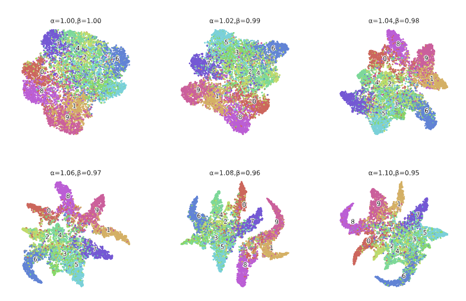
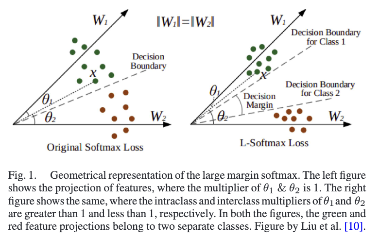

# MAAW Loss: A Better Way to Handle Imbalanced Datasets

Based on our paper titled "Margin Aware Adaptively Weighted Loss for deep learning based imbalanced data classification" published in IEEE Transactions on Artificial Intelligence 2023 (https://ieeexplore.ieee.org/document/10123019)

Hey there! This repo contains the code for our loss function, **Margin-Aware Adaptive-Weighted (MAAW) Loss**.


## The Gist

Ever had a dataset where one class has way more samples than others? This is called **class imbalance**, and it can really mess up your model's performance, making it biased towards the majority class.

Most methods that try to fix this ignore a key problem: **overlapping classes**. When classes are hard to tell apart, models tend to overfit.

Our solution? **MAAW Loss**. It's a new loss function that tackles both problems at once:
1.  It uses **Large Margin Softmax** to push classes further apart, making them easier to distinguish.
2.  It uses a **dynamic weighting system** that pays more attention to minority classes and hard-to-learn samples. The best part? It adjusts itself automatically on each mini-batch.

We've tested it on popular datasets like **CIFAR-10** and **Fashion-MNIST**, plus some real-world medical imaging datasets, and it works like a charm!

## Why is this important?

Real-world data is messy. Think about medical datasets for diagnosing diseases – you'll often have way more healthy samples than diseased ones. If a model is biased, it might fail to learn the features of the rare, but critical, minority class.

MAAW helps by making sure the model learns to separate all classes fairly, improving performance and leading to more reliable results.

## What makes MAAW special?

1.  **Two-in-one solution:** It's the first loss function (that we know of!) to solve both the class imbalance and the overlapping class problems at the same time.
2.  **Smart feature learning:** It uses L-Softmax to create a nice, big margin between classes, so your model learns more discriminative features.
3.  **Dynamic and automatic:** It automatically figures out how much weight to give each class based on how hard it is to predict, without needing any extra hyperparameters from you.
4.  **Proven results:** We've shown it works well on several benchmark and real-world imbalanced datasets.

## Get the Data

You can download the datasets we used from here:
[https://drive.google.com/drive/folders/1dyodI0nLil1P2_FoyGB10jDl5Gan2kMA?usp=sharing](https://drive.google.com/drive/folders/1dyodI0nLil1P2_FoyGB10jDl5Gan2kMA?usp=sharing)

## Visualizations


- **t-SNE visualization of the feature space (`assets/bound.png`)**: These data points are extracted as features on the CIFAR-10 dataset with IR =100 from the FCN layer preceding the classification layer. The results are shown with varied hyperparameter settings. Values of α and β are scripted in each plot. The class indices are scripted on the centroid of the data points.


- **Geometrical representation of the large margin softmax (`assets/soft.png`)**: The left figure shows the projection of features, where the multiplier of θ1 & θ2 is 1. The right figure shows the same, where the intraclass and interclass multipliers of θ1 and θ2 are greater than 1 and less than 1, respectively. In both the figures, the green and red feature projections belong to two separate classes. Figure by Liu et al.

## Code
- `MAAW.py`: The original TensorFlow/Keras implementation.
- `MAAW_torch.py`: A new PyTorch implementation.

## How to Run It

Here’s a sample command to get you started. This will run the model on the Fashion-MNIST dataset with an imbalance ratio of 10.

```bash
python3 main.py --runtimename "fmnist10"
```